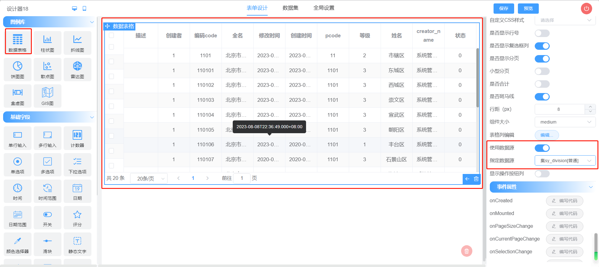
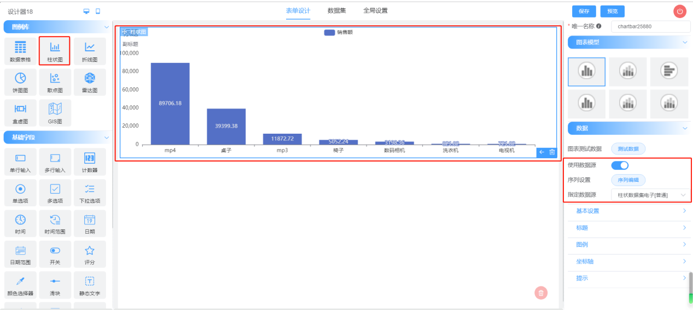
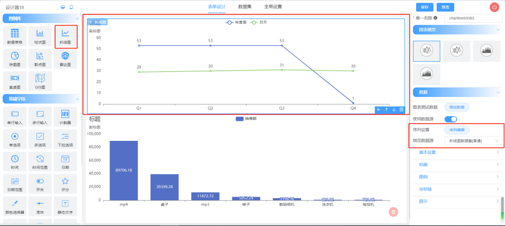
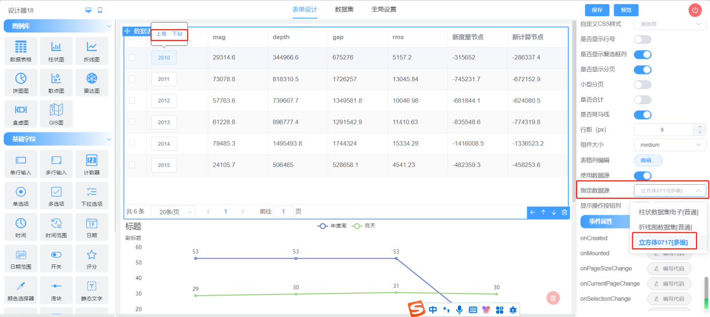

## 定位
- davav 主要定位于轻量级嵌入式数据展现和查询场景，采用npm组件式嵌入应用系统。
- datav不包括用户鉴权等基础功能，是一个纯粹的嵌入式组件。
## 功能简述
- 支持拖拽式所见即所得式设计，布局及色系调整。
- 数据表支持： 多表头、行列合并展现、多维数据上卷与下钻。
- 图标支持：柱图、饼图、这些图、散点、雷达图等常见的图表形式。
- 查询条件：支持内置固定参数、支持数据字典、支持固定值。

## 功能示意
### 数据表

### 图表


### 多维数据

### 交流群

## 文档地址 
http://docs.techhawk.cn/guide/report/summary/instructions.html
## 演示地址
http://demos.techhawk.cn/datav/
## 集成说明
获得nexus仓库访问方式

> 工具包
```
// 镜像配置
npm config set registry=http://nexus.eagle.kuaimeo.com:8090/repository/npm-local/
// 安装工具包
npm install coffee-report
```
> 依赖包
```
npm install element-ui,echarts,echarts-stat,vue-echarts,vue-echarts
```
> 配置方式
``` js
// 图表库
import "echarts";
import ECharts from 'vue-echarts'
Vue.component('v-chart', ECharts)

// UI库
import ElementUI from 'element-ui'
import 'element-ui/lib/theme-chalk/index.css'
Vue.use(ElementUI, { size: 'small' })

// 工具库
import CoffeeReport from 'coffee-report';
import 'coffee-report/DatavDesigner.css'
Vue.use(CoffeeReport)
```
> 工具库使用方式
``` vue
// 设计器
<DatavDesigner></DatavDesigner>
// 渲染器
<DatavRender :options="options"></DatavRender>
// 渲染器配置参数

  data(){
    return {
      options:{
        versionId:'276169455149514752185'
      }
    }
  }
      
```